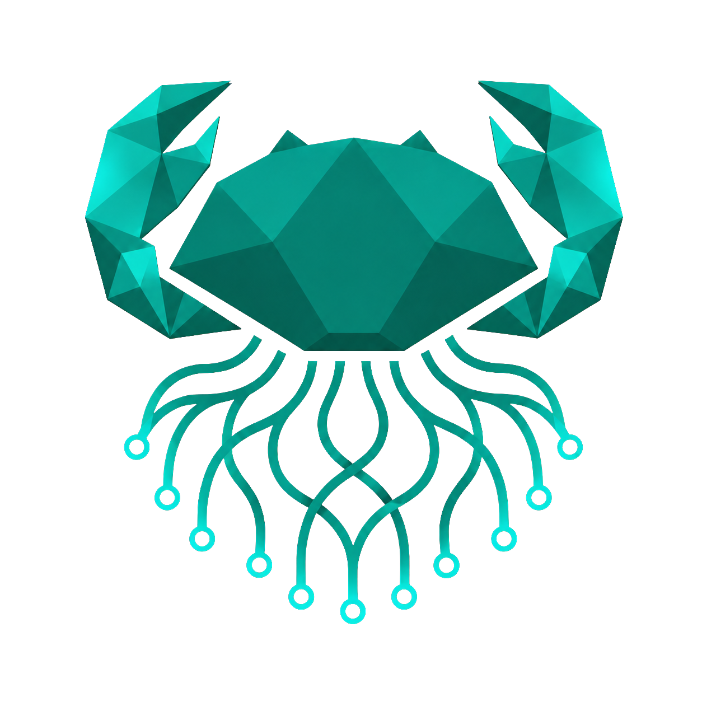

<p align="center">
  
</p>

<h1 align="center">Aratu</h1>

<p align="center"><strong>Navigate complex data ecosystems.</strong></p>

Aratu is a modern, local-first desktop database client for exploring schemas, inspecting data, running queries with explicit safeguards, and reviewing mutations before they reach a database. It combines the productivity of a native developer tool with clear trust boundaries, an architecture that can evolve across database engines, and planned AI guidance that helps users understand and operate on data without surrendering control.

## Why Aratu

Traditional database clients often place exploration, querying, and mutation behind the same level of friction and risk. Aratu aims to make complex data estates understandable while keeping potentially destructive actions deliberate, previewable, and auditable.

The planned experience is **AI-guided and human-controlled**. Assistance can interpret intent, generate and explain SQL, reveal relationships and anomalies, and recommend safer actions. Database policies remain deterministic and engine-enforced; generated operations are inspectable, and consequential changes still require review and explicit approval.

The project also serves as a senior engineering portfolio: architectural decisions, trade-offs, risks, delivery phases, and session continuity are first-class repository artifacts.

## Planned Stack

| Area | Technology |
| --- | --- |
| Desktop shell | Electron |
| Renderer | React, TypeScript, Vite |
| UI | Tailwind CSS, shadcn/ui |
| Data grids | TanStack Table |
| Server state | TanStack Query |
| UI state | Zustand |
| SQL editor | Monaco Editor |
| Relationship view | React Flow |
| Local engine | Go sidecar |
| App metadata | SQLite |
| Connectors | PostgreSQL first; SQLite second; MySQL and Oracle later |

Desktop versions and build tooling are locked through pnpm. The sidecar protocol is defined in ADR 0006; packaging and release tooling remain later decisions.

## AI-Guided Operations

The initial Stitch concepts show AI assistance embedded throughout the workflow rather than isolated in a chat window:

- analyze connection strings, infer engine and SSL settings, and flag security concerns;
- turn natural-language questions into editable SQL with syntax, cost, and read-only context;
- explain queries, relationships, tables, and generated operations;
- suggest filters, joins, cohorts, revenue columns, safe views, CRUD templates, and indexing opportunities;
- detect PII, central entities, orphan records, integrity anomalies, and schema patterns;
- recommend safety policies based on environment and recent query patterns;
- support review with visible diffs, risk analysis, generated SQL, rollback context, and production safeguards.

AI output is a proposal, not authority. The Go engine remains responsible for capability checks, query classification, limits, transactions, and production policy. AI must not silently execute SQL, bypass staged changes, or send schemas and data to a remote provider without explicit disclosure and consent.

## Current Status

**Desktop shell foundation.** The secure Electron main/preload/renderer boundary, React shell, Tailwind/shadcn setup, mock engine client, and initial protocol schemas are in place. The Go sidecar and database connectors have not been implemented yet.

## Development

Prerequisites: Node.js 22.12+ and pnpm 11.8+.

```bash
pnpm install
pnpm dev
```

On Linux systems where AppArmor blocks unprivileged user namespaces, use the explicit development-only fallback:

```bash
pnpm dev:linux
```

This passes electron-vite's `--noSandbox` flag and must never be used for production or release validation. The application configuration keeps renderer sandboxing enabled.

Quality checks:

```bash
pnpm typecheck
pnpm test
pnpm build
```

## Architecture at a Glance

```txt
React Renderer
  -> Electron Preload API
  -> Electron Main Process
  -> Go Engine Sidecar
  -> Connector abstraction
  -> PostgreSQL / SQLite / MySQL / Oracle
```

The renderer owns presentation and interaction. Electron owns the trusted desktop boundary and sidecar lifecycle. The Go engine owns database access, introspection, query policies, staged changes, and local metadata. Contracts between these parts live in `packages/contracts` and must be versioned deliberately.

See [docs/architecture.md](docs/architecture.md) and the decisions in [docs/adr/](docs/adr/).

## Roadmap

- **MVP:** PostgreSQL connection, schema exploration, table data, read-only queries, staged mutations, and review before apply.
- **Beta:** SQLite, relationship view, saved views, query history, metadata store, and baseline safety policies.
- **Future:** incremental AI-guided operations, MySQL, experimental Oracle, advanced diagrams, plugins, team workflows, data transfer, and query plans.

The ordered delivery plan is in [docs/execution-plan.md](docs/execution-plan.md); outcome-oriented milestones are in [docs/roadmap.md](docs/roadmap.md).

## Repository Layout

```txt
apps/desktop/       Electron main, preload, and React renderer
engine/             Go sidecar and database capabilities
packages/contracts/ Cross-process API contracts
packages/ui/        Shared UI primitives
packages/shared/    Shared TypeScript utilities
docs/               Product, architecture, plans, ADRs, risks, and handoffs
brand/              Brand concept, colors, and future logo assets
scripts/            Development and release automation
```

## Documentation Guide

Start with [product concept](docs/product-concept.md), [architecture](docs/architecture.md), and [execution plan](docs/execution-plan.md). Before continuing work in a new AI session, read [session handoff](docs/session-handoff.md) and the latest entry in [execution log](docs/execution-log.md). Visual direction and planned workflows are grounded in `docs/stitch/`.

## Project Stage

Aratu is in an early technical-foundation phase. The desktop shell is runnable, but screens still use mock data and the Go engine, connectors, storage, packaging, and user-facing contracts are not stable. Implementation should follow the documented phases and record material decisions as ADRs.
